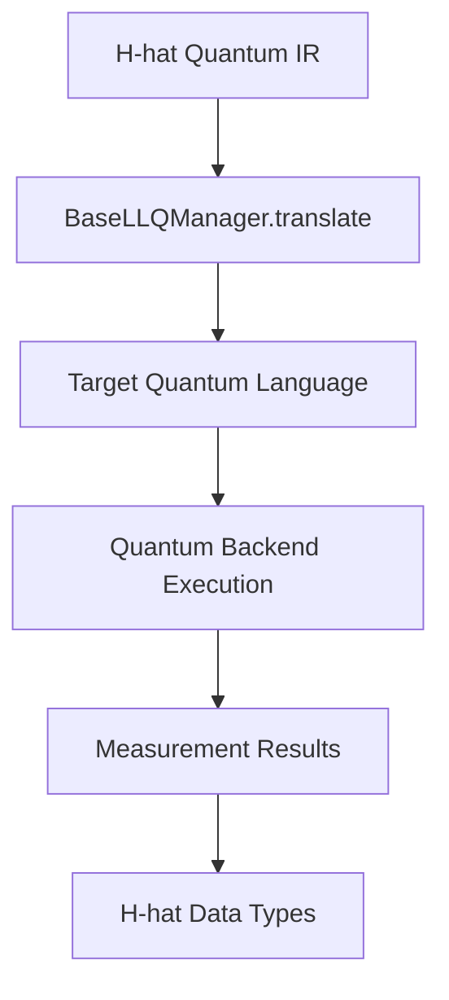

# Lowlevel

The `lowlevel` module within `core/` provides abstract interfaces for translating H-hat quantum operations to low-level quantum languages (LLQ) that target quantum backends can execute.

## Overview

This module bridges H-hat's high-level quantum abstractions with the low-level quantum assembly languages used by actual quantum hardware and simulators. It defines:
- Abstract interfaces for low-level quantum language managers
- Translation protocols from H-hat IR to LLQ
- Backend abstraction layer

## Structure

### Files

- **`abstract_qlang.py`**: Low-level quantum language abstractions
  - `BaseLLQManager`: Abstract base class for quantum language managers
  - Interface contracts for quantum code translation
  - Backend communication protocols

## Key Concepts

### BaseLLQManager

The `BaseLLQManager` class defines the interface that all low-level quantum language translators must implement. It serves as an abstraction layer between H-hat's IR and specific quantum languages like:
- **OpenQASM** (IBM Quantum, various simulators)
- **Quil** (Rigetti quantum processors)
- **Cirq** (Google quantum processors)
- **Q#** (Microsoft quantum simulators)
- **Custom quantum assembly languages**

### Translation Workflow

When quantum code needs to execute:

1. **H-hat IR**: Quantum operations in H-hat's intermediate representation
2. **LLQ Manager**: Translates IR to target quantum language
3. **Backend**: Executes quantum language code
4. **Results**: Returns measurement outcomes
5. **Post-processing**: Converts results back to H-hat types



### Manager Responsibilities

A `BaseLLQManager` implementation must:

1. **Translate Quantum Operations**:
   - Map H-hat quantum gates to LLQ equivalents
   - Handle qubit allocation and indexing
   - Translate measurement operations

2. **Manage Quantum Resources**:
   - Track qubit usage
   - Handle classical registers (for measurements)
   - Manage quantum circuit construction

3. **Backend Communication**:
   - Submit circuits to quantum backends
   - Retrieve execution results
   - Handle backend-specific requirements

4. **Error Handling**:
   - Report unsupported operations
   - Validate quantum circuits
   - Handle backend errors

### Quantum Language Features

LLQ managers must support:
- **Quantum Gates**: Unitary operations (Hadamard, CNOT, rotations, etc.)
- **Measurements**: Projective measurements in various bases
- **Classical Control**: Conditional operations based on measurements
- **Qubit Management**: Allocation, deallocation, indexing
- **Circuit Composition**: Building complex circuits from gates

## Integration with Cast Protocol

This module is crucial during the quantum-to-classical cast operation:

1. **Lazy Evaluation**: Quantum data is held unevaluated
2. **Cast Triggered**: `@quantum_var*classical_type` initiates cast
3. **Translation**: `BaseLLQManager` translates quantum IR to LLQ
4. **Execution**: Backend runs the quantum circuit
5. **Measurement**: Results returned as bit strings/counts
6. **Interpretation**: Post-processing converts to classical type

## Connections

- **`core/execution`**: `QuantumProgram` uses `BaseLLQManager` for quantum code execution
- **`core/cast`**: Cast operations trigger quantum-to-LLQ translation
- **`core/code`**: Works with IR representation of quantum operations
- **`core/memory`**: Accesses qubit index allocation via `IndexManager`
- **`low_level/quantum_lang`**: Concrete implementations of quantum language managers
- **`low_level/target_backend`**: Backend-specific communication layers

## Usage Context

The lowlevel module is invoked during:

- **Quantum Program Execution**: Running quantum circuits
- **Cast Operations**: Converting quantum data to classical
- **Backend Submission**: Preparing code for quantum hardware
- **Simulation**: Executing quantum circuits on simulators

## Concrete Implementations

While this module provides abstractions, concrete implementations exist in:
- [`low_level/quantum_lang/`](../../low_level/quantum_lang/): Specific quantum language translators
- [`low_level/target_backend/`](../../low_level/target_backend/): Backend communication layers

Each supported quantum language has its own manager implementation:
```python
class OpenQASMManager(BaseLLQManager):
    def translate(self, ir: IRGraph) -> str:
        # Generate OpenQASM code
        pass

class QuilManager(BaseLLQManager):
    def translate(self, ir: IRGraph) -> str:
        # Generate Quil code
        pass
```

## Design Philosophy

### Abstraction Benefits

By defining abstract interfaces in `core/lowlevel/`:
1. **Flexibility**: Support multiple quantum backends
2. **Portability**: H-hat code runs on different quantum hardware
3. **Extensibility**: Add new quantum languages without changing core
4. **Testing**: Mock quantum backends for testing
5. **Future-proofing**: Adapt to evolving quantum hardware

### Separation of Concerns

- **Core defines "what"**: What operations need to happen
- **Low-level defines "how"**: How to implement for specific backends

This separation allows:
- Core logic to remain stable
- Backend implementations to evolve independently
- New backends to be added seamlessly

## Extension Guidelines

To add support for a new quantum language:

1. **Create Manager Class** (in `low_level/quantum_lang/`):
   ```python
   from hhat_lang.core.lowlevel.abstract_qlang import BaseLLQManager
   
   class MyQLangManager(BaseLLQManager):
       def translate(self, ir: IRGraph) -> str:
           # Implementation
           pass
   ```

2. **Implement Translation**:
   - Map H-hat gates to target language
   - Handle qubit indexing conventions
   - Generate valid quantum assembly

3. **Backend Integration**:
   - Create backend interface (in `low_level/target_backend/`)
   - Implement circuit submission
   - Handle result retrieval

4. **Register Manager**:
   - Make available to execution engine
   - Add configuration options
   - Document supported features

## Quantum-Classical Bridge

This module is central to H-hat's hybrid paradigm:

**Classical Code**: Executed by dialect interpreter/compiler

**Quantum Code**: 
- Stored as IR (lazy evaluation)
- Translated via `BaseLLQManager`
- Executed on quantum backend
- Results returned to classical context

The `lowlevel` module ensures quantum operations integrate seamlessly with classical computation.
