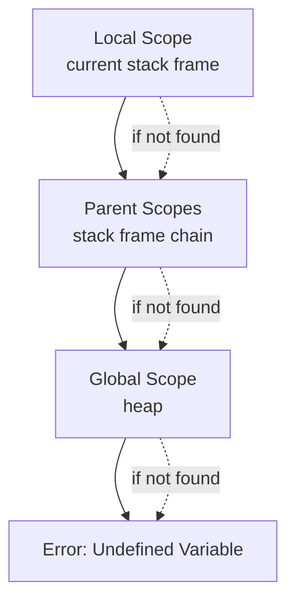

# Memory

The `memory` module implements H-hat's runtime memory management system, providing structures for storing and accessing program state including variables, functions, and quantum qubit allocations.

## Overview

This module is the runtime storage layer for H-hat programs, managing:
- Variable storage (stack and heap)
- Function definitions and lookups
- Symbol tables for name resolution
- Qubit index allocation for quantum operations
- Scope management (local, global, function scopes)
- Process identification (PID) management

## Structure

### Files

- **`core.py`**: Core memory management (695 lines)
  - `PIDManager`: Process ID management for multi-program execution
  - `IndexManager`: Qubit index allocation and tracking
  - `SymbolTable`: Maps identifiers to values/definitions
  - `Heap`: Global storage for long-lived data
  - `StackFrame`: Function call stack frame
  - `Stack`: Call stack management
  - `MemoryManager`: Orchestrates all memory operations

- **`utils.py`**: Memory utilities
  - `ScopeValue`: Enum for scope types
  - Helper functions for memory operations
  - Memory access utilities

## Key Concepts

### MemoryManager

The `MemoryManager` is the central coordinator for all memory operations:

**Components**:
- **Stack**: Function call frames with local variables
- **Heap**: Global and persistent storage
- **Symbol Tables**: Name-to-definition mappings
- **Index Manager**: Quantum qubit allocation
- **PID Manager**: Process tracking

**Responsibilities**:
- Variable storage and retrieval
- Function definition storage and lookup
- Scope management
- Qubit allocation for quantum operations
- Memory lifecycle management

### Stack Structure

The stack manages function call contexts:

**StackFrame**:
- Local symbol table (function variables)
- Parent frame reference (for nested scopes)
- Function metadata
- Return address

**Stack Operations**:
- `push()`: Create new frame for function call
- `pop()`: Remove frame after function returns
- `peek()`: Access current frame
- Scope chain traversal for variable lookup

### Heap Structure

The heap stores global and long-lived data:

```python
Heap: dict[Symbol | CompositeSymbol, DataDef | FnDef]
```

**Usage**:
- Global variables
- Module-level definitions
- Persistent data across function calls
- Shared state

**Access**:
- Key-based lookups using symbols
- Supports both simple and composite symbols
- Error handling for invalid keys

### Symbol Tables

Symbol tables map names to definitions:

**Structure**:
```python
SymbolTable: OrderedDict[Symbol | CompositeSymbol, DataDef | Literal | FnDef]
```

**Features**:
- Ordered insertion (preserves definition order)
- Supports variable and function definitions
- Scope-aware lookups
- Name shadowing support

**Lookup Process**:
1. Check current scope (current stack frame)
2. If not found, check parent scopes
3. If still not found, check heap (global scope)
4. Error if undefined

### IndexManager

Manages quantum qubit indices:

**Purpose**:
- Track available qubits
- Allocate qubits to quantum variables
- Deallocate qubits when no longer needed
- Prevent index conflicts

**Operations**:
- `allocate()`: Reserve qubit index
- `deallocate()`: Free qubit index
- `is_available()`: Check index availability
- `list_allocated()`: Get all allocated indices

**Integration**:
- Works with quantum data definitions
- Coordinates with quantum backends
- Ensures valid qubit addressing

### PIDManager

Manages process identifiers:

**Purpose**:
- Track multiple program executions
- Support concurrent/parallel execution
- Isolate program states

**Operations**:
- `new()`: Generate new PID (UUID-based)
- `list()`: Get all active PIDs

### Scope Management

H-hat supports multiple scope levels:

**Scope Types** (from `utils.ScopeValue`):
- **Global**: Module/file level
- **Function**: Function local
- **Block**: Control flow blocks (if, loop, etc.)
- **Closure**: Captured variables in nested functions

**Variable Resolution**:


## Memory Operations

### Variable Operations

**Declaration**:
```python
mem.declare_var(name: Symbol, type: BaseTypeDef, value: Literal)
```

**Assignment**:
```python
mem.assign_var(name: Symbol, value: Literal | DataDef)
```

**Retrieval**:
```python
value = mem.get_var(name: Symbol)
```

### Function Operations

**Registration**:
```python
mem.register_fn(header: FnHeader, definition: FnDef)
```

**Lookup**:
```python
fn_def = mem.lookup_fn(header: FnHeader)
```

### Qubit Index Operations

**Allocation**:
```python
index = mem.index_manager.allocate()
```

**Deallocation**:
```python
mem.index_manager.deallocate(index)
```

## Error Handling

Memory operations can raise specific errors:

- **`HeapInvalidKeyError`**: Invalid heap key access
- **`IndexAllocationError`**: Qubit allocation failure
- **`IndexInvalidVarError`**: Invalid qubit index reference
- **`StackFrameGetError`**: Stack frame access error
- **`StackFrameNotFnError`**: Expected function frame, got different type
- **`IndexUnknownError`**: Unknown index reference

These integrate with [`core/error_handlers`](../error_handlers/) for consistent error reporting.

## Connections

- **`core/data`**: Stores `DataDef`, `Literal`, function definitions
- **`core/code`**: Uses `FnHeader` for function lookups
- **`core/types`**: Variable storage validates type constraints
- **`core/execution`**: Executors read/write memory during evaluation
- **`core/fns`**: Functions stored and retrieved from memory
- **`core/error_handlers`**: Reports memory-related errors
- **All core modules**: Memory is accessed throughout program execution

## Usage Context

Memory operations occur during:

- **Variable Declaration**: Adding variables to scope
- **Variable Assignment**: Updating variable values
- **Variable Access**: Reading variable values
- **Function Calls**: Creating stack frames
- **Function Returns**: Popping stack frames
- **Quantum Operations**: Allocating qubit indices
- **Module Loading**: Registering global definitions

## Memory Lifecycle

**Program Start**:
1. Initialize `MemoryManager`
2. Create initial heap
3. Create first stack frame (main)
4. Load built-in definitions

**During Execution**:
1. Function calls push new frames
2. Variables declared in current scope
3. Qubits allocated as needed
4. Variables updated and accessed

**Function Calls**:
1. Push new `StackFrame`
2. Bind arguments to parameters
3. Execute function body
4. Pop frame on return

**Program End**:
1. Pop all stack frames
2. Clear heap
3. Deallocate all qubit indices
4. Clean up resources

## Design Considerations

### Efficiency

- Ordered dictionaries for predictable behavior
- Direct key lookups for O(1) access
- Minimal copying (reference-based where safe)

### Safety

- Type validation on storage
- Scope enforcement
- Index conflict prevention
- Error handling for invalid operations

### Quantum-Specific Features

- Qubit index management unique to quantum computing
- Lazy evaluation support (quantum data not immediately evaluated)
- Integration with quantum backend resource management

## Extension Guidelines

When extending memory functionality:

1. **Add New Storage Types**:
   - Extend `MemoryManager` with new storage structures
   - Maintain separation of concerns

2. **Implement Custom Scoping**:
   - Extend `ScopeValue` enum
   - Update scope resolution logic

3. **Optimize Performance**:
   - Consider caching frequently accessed data
   - Profile memory access patterns
   - Balance memory usage vs. speed

4. **Support New Paradigms**:
   - Add storage for new data models
   - Extend index management for new resources
