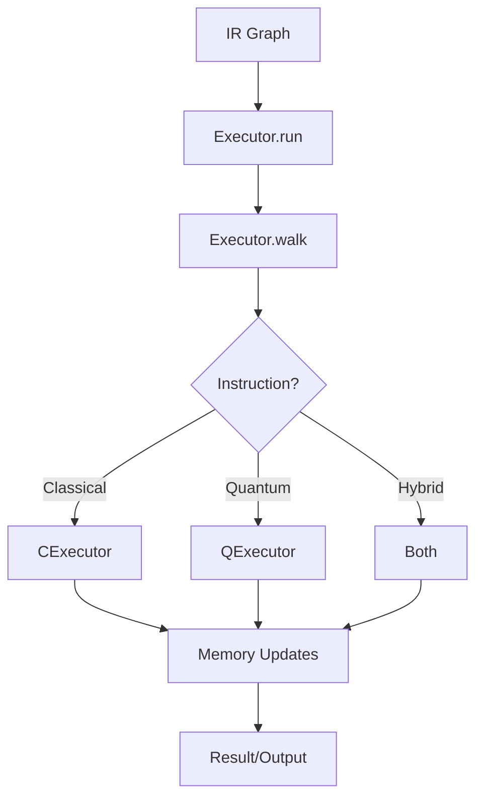

# Heather Execution Module

The `execution` module implements Heather's program execution engine, providing interpreters for both classical and quantum code execution.

## Overview

This module contains Heather's execution infrastructure, enabling the evaluation of compiled Heather IR. It implements:
- Main executor coordinating execution
- Classical code executor
- Quantum code executor
- New IR evaluation logic
- Execution strategy for hybrid quantum-classical programs

## Structure

### Files

- **`executor.py`**: Main Heather executor
  - `Executor`: Primary execution coordinator
  - `CExecutor`: Classical code evaluator
  - `QExecutor`: Quantum code evaluator
  - IR traversal and evaluation logic

- **`new_ir.py`**: Next-generation IR execution
  - Updated execution strategies
  - Enhanced IR evaluation
  - Improved performance characteristics

### Subdirectories

#### `classical/`
Classical instruction execution:
- Classical operation implementations
- Standard computational logic
- Classical data manipulation

#### `quantum/`
Quantum instruction execution:
- Quantum gate execution
- Quantum state management
- Measurement operations
- Integration with quantum backends

## Key Concepts

### Heather Executor

The `Executor` class extends `BaseExecutor` from core:

```python
class Executor(BaseExecutor):
    def __init__(self):
        self._cexec = CExecutor()  # Classical executor
        self._qexec = QExecutor()  # Quantum executor
```

**Components**:
- **Main Executor**: Coordinates execution, dispatches to sub-executors
- **Classical Executor**: Handles classical instructions
- **Quantum Executor**: Handles quantum instructions

### Execution Flow



### run() Method

Initiates execution:

```python
def run(
    self,
    *,
    code: Any,
    mem: MemoryManager,
    node: IRNode,
    ir_graph: IRGraph,
    **kwargs: Any,
) -> None:
    self.walk(code, mem, node, ir_graph)
```

**Parameters**:
- **`code`**: IR code to execute
- **`mem`**: Memory manager for state
- **`node`**: Current IR node
- **`ir_graph`**: Complete IR graph context
- **`kwargs`**: Additional execution options

### walk() Method

Traverses and executes IR:

```python
def walk(
    self,
    code: Any,
    mem: MemoryManager,
    node: IRNode,
    ir_graph: IRGraph,
    **kwargs: Any,
) -> Any:
    # Traverse IR nodes
    # Dispatch to appropriate executor
    # Update memory state
    # Return results
```

**Traversal Strategy**:
- Depth-first IR graph traversal
- Node-by-node execution
- Control flow handling (branches, loops)
- Function call management

### Classical Executor (CExecutor)

Handles classical computation:

**Responsibilities**:
- Arithmetic operations (+, -, *, /, %)
- Logical operations (and, or, not)
- Comparisons (<, >, ==, !=, <=, >=)
- Variable access and mutation
- Function calls (classical)
- Control flow (if, while, for)
- I/O operations

**Execution Model**:
- Immediate evaluation
- Standard computational semantics
- Direct memory updates

### Quantum Executor (QExecutor)

Handles quantum computation:

**Responsibilities**:
- Quantum gate applications
- Quantum state management
- Qubit allocation and deallocation
- Measurement operations
- Quantum circuit construction
- Backend submission

**Execution Model**:
- Lazy evaluation (until measurement)
- Quantum circuit building
- Backend execution when needed

### Hybrid Execution

Heather supports hybrid quantum-classical programs:

**Pattern**:
```heather
// Classical initialization
var n: u64 = 10

// Quantum preparation
var qstate: QuantumState = create_superposition(n)

// Quantum operations
apply_quantum_algorithm(qstate)

// Measurement (quantum → classical)
var result: u64 = @qstate*u64

// Classical post-processing
process_result(result)
```

**Executor Coordination**:
1. Classical initialization → `CExecutor`
2. Quantum preparation → `QExecutor` (lazy)
3. Quantum operations → `QExecutor` (circuit building)
4. Measurement/cast → `QExecutor` execution + cast protocol
5. Classical post-processing → `CExecutor`

### Instruction Dispatch

The executor dispatches based on IR node type:

**Dispatch Table**:
```python
DeclareInstr      → CExecutor (variable declaration)
AssignInstr       → CExecutor (assignment)
CallInstr         → CExecutor/QExecutor (depends on function)
CastInstr         → Cast protocol (may invoke QExecutor)
QuantumGateInstr  → QExecutor
MeasureInstr      → QExecutor
```

### Memory Integration

Executors interact with memory:

**Read Operations**:
- Variable lookup
- Function retrieval
- Type information access

**Write Operations**:
- Variable assignment
- New variable allocation
- Function result storage

**Qubit Management**:
- Index allocation via `IndexManager`
- Qubit state tracking
- Measurement result storage

## Connections

- **`core/execution`**: Implements `BaseExecutor`, `BaseClassicalEvaluator`, `BaseQuantumEvaluator`
- **`dialects/heather/compiler`**: Executes compiled IR
- **`dialects/heather/code`**: Interprets Heather-specific IR nodes
- **`core/memory`**: Manages program state via `MemoryManager`
- **`core/code`**: Traverses `IRGraph` and `IRNode` structures
- **`core/cast`**: Invoked for type conversions
- **`core/lowlevel`**: Uses quantum language managers for backend submission
- **`low_level/quantum_lang`**: Quantum instruction translation
- **`low_level/target_backend`**: Backend communication

## Usage Context

The executor is invoked by:

- **CLI**: `hhat run program.hat`
- **REPL**: Interactive code execution
- **Testing**: Automated test execution
- **Jupyter Notebooks**: Cell-by-cell execution
- **IDE**: Code running and debugging

## Execution Modes

### Interpretation

Direct IR execution:
- Node-by-node evaluation
- Immediate results
- Good for development and debugging

### JIT Compilation (Future)

Just-in-time native code generation:
- Compile hot paths to native code
- Improved performance
- Hybrid interpretation + compilation

### Quantum Execution Modes

**Simulation**:
- Local quantum simulator
- Full state vector simulation
- Good for development and testing

**Hardware**:
- Real quantum device execution
- Actual quantum computation
- Production workloads

## Error Handling

Execution errors are caught and reported:

**Runtime Errors**:
- Division by zero
- Type errors (if not caught at compile time)
- Undefined variable access
- Index out of bounds
- Quantum backend errors
- Measurement failures

**Error Reporting**:
- Clear error messages
- Stack traces (IR node trace)
- Source location information
- Suggested fixes

## Performance Considerations

### Classical Execution

- Interpreted execution overhead
- Python call overhead
- Memory access patterns

**Optimizations**:
- Inline simple operations
- Cache frequently accessed variables
- Minimize memory allocations

### Quantum Execution

- Circuit construction overhead
- Backend submission latency
- Measurement sampling time

**Optimizations**:
- Batch quantum operations
- Minimize circuit submissions
- Reuse quantum circuits when possible

## Extension Guidelines

To extend execution capabilities:

1. **Add New Instructions**:
   - Implement evaluation logic
   - Update dispatch table
   - Handle memory updates

2. **Optimize Execution**:
   - Profile execution bottlenecks
   - Implement specialized evaluators
   - Cache computed values

3. **Support New Quantum Operations**:
   - Extend `QExecutor`
   - Add quantum gate implementations
   - Integrate with new backends

4. **Debugging Support**:
   - Add breakpoints
   - Implement step execution
   - Track execution trace

5. **Profiling**:
   - Measure execution time per instruction
   - Track memory usage
   - Identify hot paths

## Future Enhancements

Potential execution improvements:

- **JIT Compilation**: Compile IR to native code
- **Parallelization**: Execute independent operations concurrently
- **Caching**: Memoize pure function results
- **Streaming Execution**: Handle infinite data streams
- **Incremental Execution**: Only re-execute changed code
- **Advanced Debugging**: Time-travel debugging, reversible execution
- **GPU Acceleration**: Use GPUs for classical computations
- **Distributed Execution**: Execute across multiple machines
